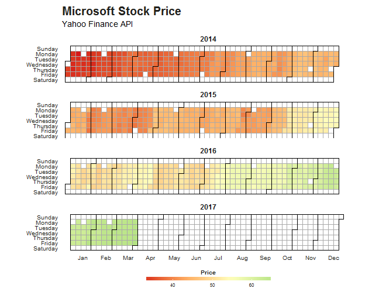

Nowadays you can find calendar heatmaps on every GitHub profile. The first time I saw a one, it was the [winning entry](http://stat-computing.org/dataexpo/2009/posters/wicklin-allison.pdf)  for the [JSM Data Expo in 2009](http://stat-computing.org/dataexpo/2009/).  What amazed me most was that it was created in SAS which is not especially well-known for nice visualisations. Only a short time later the R community was able to replicate similar calendar heatmaps thanks to [Paul Bleicher's](http://blog.revolutionanalytics.com/2009/11/charting-time-series-as-calendar-heat-maps-in-r.html) lattice based implementation.

Being always a big fan of [Hadley Wickham's](http://hadley.nz/) ggplot2 I wanted to implement my own calendar heatmap version in ggplot2. For plotting your own time-series you only need the [ggplot2 package](http://ggplot2.org/) and the following function. The [lubridate package](https://cran.r-project.org/web/packages/lubridate/index.html) might come in handy to transform the dates. One nice feature of my solution is that you can adjust the ggplot object as you like.

## Preview


## Code


```r
#' Calendar Heatmap
#' 
#' Creates a colour coded calendar visualising time series data
#' 
#' @param dates A vector containing the dates in `Date` format.
#' @param values A vector containing the corresponding values as numeric.
#' @param title Main plot title (optional).
#' @param subtitle Main plot subtitle (optional).
#' @param legendtitle Legend title (optional).
#'   
#' @return ggplot object
calendarHeatmap <- function(dates, values, title = "", subtitle = "", legendtitle = ""){
  
  # Parameter checks
  if(missing(dates)){
    stop("Need to specify a dates vector.")
  }
  if(missing(values)){
    stop("Need to specify a values vector.")
  }
  if(!is.Date(dates)){
    stop("dates vector need to be in Date format.")
  }
  if(length(dates) != length(values)){
    stop("dates and values need to have the same length.")
  }
    
  
  # load required packages
  require(ggplot2)
  
  my_theme <- function() {
    
    # Colors
    color.background = "white"
    color.text = "#22211d"
    
    # Begin construction of chart
    theme_bw(base_size=15) +
      
      # Format background colors
      theme(panel.background = element_rect(fill=color.background, color=color.background)) +
      theme(plot.background  = element_rect(fill=color.background, color=color.background)) +
      theme(panel.border     = element_rect(color=color.background)) +
      theme(strip.background = element_rect(fill=color.background, color=color.background)) +
      
      # Format the grid
      theme(panel.grid.major = element_blank()) +
      theme(panel.grid.minor = element_blank()) +
      theme(axis.ticks       = element_blank()) +
      
      # Format the legend
      theme(legend.position = "bottom") +
      theme(legend.text = element_text(size = 8, color = color.text)) +
      theme(legend.title = element_text(size = 10, face = "bold", color = color.text)) +
      
      # Format title and axis labels
      theme(plot.title       = element_text(color=color.text, size=20, face = "bold")) +
      theme(axis.text.x      = element_text(size=12, color="black")) +
      theme(axis.text.y      = element_text(size=12, color="black")) +
      theme(axis.title.x     = element_text(size=14, color="black", face = "bold")) +
      theme(axis.title.y     = element_text(size=14, color="black", vjust=1.25)) +
      theme(axis.text.x      = element_text(size=10, hjust = 0, color = color.text)) +
      theme(axis.text.y      = element_text(size=10, color = color.text)) +
      theme(strip.text       = element_text(face = "bold")) + 
      
      # Plot margins
      theme(plot.margin = unit(c(0.35, 0.2, 0.3, 0.35), "cm"))
  }
  
  # create empty calendar
  min.date <- as.Date(paste(format(min(dates), "%Y"),"-1-1",sep = ""))
  max.date <- as.Date(paste(format(max(dates), "%Y"),"-12-31", sep = ""))
  df <- data.frame(date = seq(min.date, max.date, by="days"), value = NA)
  
  # fill in values
  df$value[match(dates, df$date)] <- values
  
  df$year  <-  as.factor(format(df$date, "%Y"))
  df$month <- as.numeric(format(df$date, "%m"))
  df$doy   <- as.numeric(format(df$date, "%j"))
  #df$dow  <- as.numeric(format(df$date, "%u"))
  #df$woy  <- as.numeric(format(df$date, "%W"))
  df$dow <- as.numeric(format(df$date, "%w"))
  df$woy <- as.numeric(format(df$date, "%U")) + 1
  
  df$dowmapped <- ordered(df$dow, levels = 6:0)
  levels(df$dowmapped) <- rev(c("Sunday","Monday","Tuesday","Wednesday","Thursday","Friday","Saturday"))
  
  g <- ggplot(df, aes(woy, dowmapped, fill = value)) + 
    geom_tile(colour = "darkgrey") + 
    facet_wrap(~year, ncol = 1) + # Facet for years
    coord_equal(xlim = c(2.5,54)) + # square tiles
    scale_x_continuous(breaks = 53/12*(1:12)-1.5, labels = c("Jan","Feb","Mar","Apr","May","Jun","Jul","Aug","Sep","Oct","Nov","Dec")) + 
    my_theme() +
    scale_fill_gradientn(colours = c("#D61818", "#FFAE63", "#FFFFBD", "#B5E384"), na.value = "white",
                         name = legendtitle,
                         guide = guide_colorbar(
                           direction = "horizontal",
                           barheight = unit(2, units = "mm"),
                           barwidth = unit(75, units = "mm"),
                           title.position = 'top',
                           title.hjust = 0.5
                         )) +
    labs(x = NULL, 
         y = NULL, 
         title = title, 
         subtitle = subtitle)
  
  my.lines<-data.frame(x=numeric(), 
                       y=numeric(), 
                       xend=numeric(), 
                       yend=numeric(), 
                       year=character())
  
  for(years in levels(df$year)){
    df.subset <- df[df$year == years,]
    
    y.start <- df.subset$dow[1]
    x.start <- df.subset$woy[1]
    
    x.top.left <- ifelse(y.start == 0, x.start - 0.5, x.start + 0.5)
    y.top.left <- 7.5
    x.top.right <- df.subset$woy[nrow(df.subset)] + 0.5
    y.top.right <- 7.5
    
    x.mid.left01 <- x.start - 0.5
    y.mid.left01 <- 7.5 - y.start
    x.mid.left02 <- x.start + 0.5
    y.mid.left02 <- 7.5 - y.start
    
    x.bottom.left <- x.start - 0.5
    y.bottom.left <- 0.5
    x.bottom.right <- ifelse(y.start == 6, df.subset$woy[nrow(df.subset)] + 0.5, df.subset$woy[nrow(df.subset)] - 0.5)
    y.bottom.right <- 0.5
    
    my.lines<-rbind(my.lines,
                    data.frame(x    = c(x.top.left, x.bottom.left, x.mid.left01, x.top.left, x.bottom.left), 
                               y    = c(y.top.left, y.bottom.left, y.mid.left01, y.top.left, y.bottom.left),
                               xend = c(x.top.right, x.bottom.right, x.mid.left02, x.mid.left02, x.mid.left01), 
                               yend = c(y.top.right, y.bottom.right, y.mid.left02, y.mid.left02, y.mid.left01), 
                               year = years))
    
    # lines to separate months
    for (j in 1:12)  {
      df.subset.month <- max(df.subset$doy[df.subset$month == j])
      x.month <- df.subset$woy[df.subset.month]
      y.month <- df.subset$dow[df.subset.month]
      
      x.top.mid <- x.month + 0.5
      y.top.mid <- 7.5
      
      x.mid.mid01 <- x.month - 0.5
      y.mid.mid01 <- 7.5 - y.month - 1
      x.mid.mid02 <- x.month + 0.5
      y.mid.mid02 <- 7.5 - y.month - 1
      
      x.bottom.mid <- ifelse(y.month == 6, x.month + 0.5, x.month - 0.5)
      y.bottom.mid <- 0.5
      
      my.lines<-rbind(my.lines,
                      data.frame(x    = c(x.top.mid, x.mid.mid01, x.mid.mid01), 
                                 y    = c(y.top.mid, y.mid.mid01, y.mid.mid01),
                                 xend = c(x.mid.mid02, x.mid.mid02, x.bottom.mid), 
                                 yend = c(y.mid.mid02, y.mid.mid02, y.bottom.mid), 
                                 year = years))
      
    }
    
  }
  
  # add lines
  g <- g + geom_segment(data=my.lines, aes(x,y,xend=xend, yend=yend), lineend = "square", color = "black", inherit.aes=FALSE)
  
  return(g)
}
```

## Example

In the following example I visualise Microsoft's stock price starting from 2014 with the help of [Yahoo Finance API](https://de.finance.yahoo.com/quote/AAPL?ltr=1).


```r
stock <- "MSFT"
start.date <- "2014-00-01" # workaround for a small bug with the month extraction
end.date <- Sys.Date()
quote <- paste("http://ichart.finance.yahoo.com/table.csv?s=",
               stock,
               "&a=", substr(start.date,6,7),
               "&b=", substr(start.date, 9, 10),
               "&c=", substr(start.date, 1,4), 
               "&d=", substr(end.date,6,7),
               "&e=", substr(end.date, 9, 10),
               "&f=", substr(end.date, 1,4),
               "&g=d&ignore=.csv", sep="")             
stock.data <- read.csv(quote, as.is=TRUE)

require(lubridate)

dates <- ymd(stock.data$Date)
values <- stock.data$Adj.Close

calendarHeatmap(dates, values, title = "Microsoft Stock Price", subtitle = "Yahoo Finance API", legendtitle = "Price")
```



## SessionInfo


```
## R version 3.3.1 (2016-06-21)
## Platform: x86_64-w64-mingw32/x64 (64-bit)
## Running under: Windows >= 8 x64 (build 9200)
## 
## locale:
## [1] LC_COLLATE=German_Germany.1252  LC_CTYPE=German_Germany.1252   
## [3] LC_MONETARY=German_Germany.1252 LC_NUMERIC=C                   
## [5] LC_TIME=German_Germany.1252    
## 
## attached base packages:
## [1] stats     graphics  grDevices utils     datasets  methods   base     
## 
## other attached packages:
## [1] ggplot2_2.2.1   lubridate_1.6.0 knitr_1.14     
## 
## loaded via a namespace (and not attached):
##  [1] Rcpp_0.12.6      digest_0.6.9     assertthat_0.1   grid_3.3.1      
##  [5] plyr_1.8.4       gtable_0.2.0     formatR_1.4      magrittr_1.5    
##  [9] evaluate_0.9     scales_0.4.1     stringi_1.1.1    lazyeval_0.2.0  
## [13] labeling_0.3     tools_3.3.1      stringr_1.0.0    munsell_0.4.3   
## [17] colorspace_1.2-6 tibble_1.1
```
