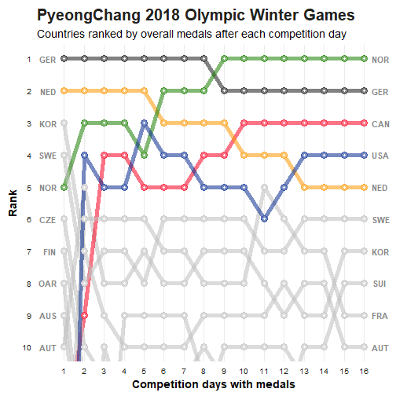

A **Bump Chart** is a special form of a line plot. This kind of plot is designed for exploring changes in rank over time. The focus here is usually on comparing the position or performance of multiple observations with respect to each other rather than the actual values itself.

Such visualisation can be used to track the leaderboard in soccer or the medal table in tournaments. I will use data from the recent [Olympic Winter Games in PyeongChang](https://www.pyeongchang2018.com/en/index) to demonstrate the power of the Bump Chart.

**Required data**

* data.frame with ranking of every individual over time. All individuals have to be ranked at the same point in time.

## Preview


## Required packages

Importing the [ggplot2](https://cran.r-project.org/web/packages/ggplot2/index.html) package is mandatory. [dplyr](https://cran.r-project.org/web/packages/dplyr/index.html) on the other hand can be replaced by other data manipulation libraries.


```r
library(dplyr)   # data manipulation
library(ggplot2) # visualisation
```

## Data foundation

Before we can start building the Bump Chart we first need to get the data in the correct shape. Let's assume that we start with the number of cumulated medals after each competition day per country. 


```
##         date country gold silver bronze
## 1 2018-02-10     GER    2      0      0
## 2 2018-02-10     NED    1      2      1
## 3 2018-02-10     KOR    1      0      0
## 4 2018-02-10     SWE    1      0      0
## 5 2018-02-10     NOR    0      3      1
```

```
##           date country gold silver bronze
## 451 2018-02-25     NOR   14     14     11
## 452 2018-02-25     GER   14     10      7
## 453 2018-02-25     CAN   11      8     10
## 454 2018-02-25     USA    9      8      6
## 455 2018-02-25     NED    8      6      6
```

The data shown here, was extracted from the [official homepage](https://www.pyeongchang2018.com/en/game-time/results/OWG2018/en/general/daily-medallists-date=2018-02-17.htm) with the help of the [rvest package](https://cran.r-project.org/web/packages/rvest/). To ensure reproducibility of the plots I attached the data at the end of the blog post.

We first have to rank the countries based on their accumulated number of gold, silver and bronze medals for every day of the Olympic Games. In case of a tie the countries are ranked in alphabetical order.


```r
df.rankings <- df %>% 
  group_by(date) %>% 
  arrange(date, desc(gold), desc(silver), desc(bronze), country) %>% 
  mutate(ranking = row_number(),
         day = as.numeric(as.Date(date)) - 17571) %>% 
  as.data.frame()
```


```
##         date country gold silver bronze ranking day
## 1 2018-02-10     GER    2      0      0       1   1
## 2 2018-02-10     NED    1      2      1       2   1
## 3 2018-02-10     KOR    1      0      0       3   1
## 4 2018-02-10     SWE    1      0      0       4   1
## 5 2018-02-10     NOR    0      3      1       5   1
```

```
##           date country gold silver bronze ranking day
## 451 2018-02-25     NOR   14     14     11       1  16
## 452 2018-02-25     GER   14     10      7       2  16
## 453 2018-02-25     CAN   11      8     10       3  16
## 454 2018-02-25     USA    9      8      6       4  16
## 455 2018-02-25     NED    8      6      6       5  16
```

## Basic Version

A simple version of the bump chart is created by using the syntax for a line chart and reversing the y axis. 


```r
ggplot(data = df.rankings, aes(x = day, y = ranking, group = country)) +
  geom_line(aes(color = country, alpha = 1), size = 2) +
  geom_point(aes(color = country, alpha = 1), size = 4) +
  scale_y_reverse(breaks = 1:nrow(df.rankings))
```


Now we can see, that the data is in the correct format but the plot looks really ugly and shouldn't be used in its current shape.

## Style it

With the help some simple theme changes and adding the country information next to the lines we can clean up the mess. 


```r
my_theme <- function() {

  # Colors
  color.background = "white"
  color.text = "#22211d"

  # Begin construction of chart
  theme_bw(base_size=15) +

    # Format background colors
    theme(panel.background = element_rect(fill=color.background, color=color.background)) +
    theme(plot.background  = element_rect(fill=color.background, color=color.background)) +
    theme(panel.border     = element_rect(color=color.background)) +
    theme(strip.background = element_rect(fill=color.background, color=color.background)) +

    # Format the grid
    theme(panel.grid.major.y = element_blank()) +
    theme(panel.grid.minor.y = element_blank()) +
    theme(axis.ticks       = element_blank()) +

    # Format the legend
    theme(legend.position = "none") +

    # Format title and axis labels
    theme(plot.title       = element_text(color=color.text, size=20, face = "bold")) +
    theme(axis.title.x     = element_text(size=14, color="black", face = "bold")) +
    theme(axis.title.y     = element_text(size=14, color="black", face = "bold", vjust=1.25)) +
    theme(axis.text.x      = element_text(size=10, vjust=0.5, hjust=0.5, color = color.text)) +
    theme(axis.text.y      = element_text(size=10, color = color.text)) +
    theme(strip.text       = element_text(face = "bold")) +

    # Plot margins
    theme(plot.margin = unit(c(0.35, 0.2, 0.3, 0.35), "cm"))
}
```

For the sake of clarity we will only focus on the top 10 `show.top.n <- 10` observations. Be careful to limit the y axis in the plot and not filter the data beforehand, otherwise the plot will be incorrect.


```r
show.top.n <- 10

ggplot(data = df.rankings, aes(x = day, y = ranking, group = country)) +
  geom_line(aes(color = country, alpha = 1), size = 2) +
  geom_point(aes(color = country, alpha = 1), size = 4) +
  geom_point(color = "#FFFFFF", size = 1) +
  scale_y_reverse(breaks = 1:show.top.n) +
  scale_x_continuous(breaks = 1:16, minor_breaks = 1:16, expand = c(.05, .05)) +
  geom_text(data = df.rankings %>% filter(day == "1"),
            aes(label = country, x = 0.5) , hjust = .85, fontface = "bold", color = "#888888", size = 4) +
  geom_text(data = df.rankings %>% filter(day == "16"),
            aes(label = country, x = 16.5) , hjust = 0.15, fontface = "bold", color = "#888888", size = 4) +
  coord_cartesian(ylim = c(1,show.top.n)) + 
  theme(legend.position = "none") +
  labs(x = "Competition days with medals",
       y = "Rank",
       title = "PyeongChang 2018 Olympic Winter Games",
       subtitle = "Countries ranked by overall medals after each competition day") +
  my_theme() 
```


This already looks way better and we can improve it even further.

## Highlight

By highlighting only a few of the lines we can emphasise these countries in the plot. Therefore, we need to create a new feature for the colour parameter where all non-highlighted observations are labeled as 'zzz'.


```r
df.rankings <- df.rankings %>%
  mutate(flag = ifelse(country %in% c("NOR","GER","CAN","USA","NED"), TRUE, FALSE),
         country_col = if_else(flag == TRUE, country, "zzz"))
```

The bump chart code needs only minor changes. Both the `color` parameter and the colour palette `scale_color_manual()` are updated accordingly.


```r
show.top.n <- 10

ggplot(data = df.rankings, aes(x = day, y = ranking, group = country)) +
  geom_line(aes(color = country_col, alpha = 1), size = 2) +
  geom_point(color = "#FFFFFF", size = 4) +
  geom_point(aes(color = country_col, alpha = 1), size = 4) +
  geom_point(color = "#FFFFFF", size = 1) +
  scale_y_reverse(breaks = 1:show.top.n) +
  scale_x_continuous(breaks = 1:16, minor_breaks = 1:16, expand = c(.05, .05)) +
  geom_text(data = df.rankings %>% filter(day == "1"),
            aes(label = country, x = 0.5) , hjust = .85, fontface = "bold", color = "#888888", size = 4) +
  geom_text(data = df.rankings %>% filter(day == "16"),
            aes(label = country, x = 16.5) , hjust = 0.15, fontface = "bold", color = "#888888", size = 4) +
  coord_cartesian(ylim = c(1,show.top.n)) + 
  theme(legend.position = "none") +
  labs(x = "Competition days with medals",
       y = "Rank",
       title = "PyeongChang 2018 Olympic Winter Games",
       subtitle = "Countries ranked by overall medals after each competition day") +
  my_theme() +
  scale_color_manual(values = c("#F70020","#191A1A","#FB9701","#1A7D00","#072C8F","grey"))
```



Thanks to these small adjustments it is easy to track the winning countries of the Olympic Games in PyeongChang.

## Flag icons

Instead of using 3-Letter Country Codes we can also use fancy flags icons from the [ggflags package](https://github.com/rensa/ggflags). The flag SVG assets, used under the [CC-BY licence](https://github.com/eosrei/emojione-color-font/blob/master/LICENSE-CC-BY.txt), are taken from the [EmojiOne](https://github.com/eosrei/emojione-color-font) set. Both **ggflags** and **grImport2** (which is required by ggflags) need to be installed from GitHub.


```r
# devtools::install_github("sjp/grImport2")
# devtools::install_github("rensa/ggflags")

library(ggflags) # data visualization
```

For visualizing the right flags we need to manually enhance our data with the 2 digit ISO Country Code. You can lookup this information at [CountryCode.org](https://countrycode.org).


```r
country_flags_start <- data.frame(
  x = 0.3, y = 1:8, 
  country = c("de","nl","kr","se","no","cz","fi","ru"), 
  stringsAsFactors = FALSE)

country_flags_end <- data.frame(
  x = 16.8, y = 1:10, 
  country = c("no","de","ca","us","nl","se","kr","ch","fr","at"), 
  stringsAsFactors = FALSE)
```

We only start with eight entries on the left side due to the fact that after the first day of the Olympic Games only eight countries won at least one medal. Rank 9 and 10 stay unlabled.

Instead of `geom_text` we now have to use `geom_flag`.


```r
show.top.n <- 10

ggplot(data = df.rankings, aes(x = day, y = ranking, group = country)) +
  geom_line(aes(color = country_col, alpha = 1), size = 2) +
  geom_point(color = "#FFFFFF", size = 4) +
  geom_point(aes(color = country_col, alpha = 1), size = 4) +
  geom_point(color = "#FFFFFF", size = 1) +
  scale_y_reverse(breaks = 1:show.top.n) +
  scale_x_continuous(breaks = 1:16, minor_breaks = 1:16, expand = c(.05, .05)) +
  geom_flag(data = country_flags_start, aes(x = x, y = y, country = country, size = 1)) +
  geom_flag(data = country_flags_end, aes(x = x, y = y, country = country, size = 1)) +
  coord_cartesian(ylim = c(1,show.top.n)) + 
  theme(legend.position = "none") +
  labs(x = "Competition days with medals",
       y = "Rank",
       title = "PyeongChang 2018 Olympic Winter Games",
       subtitle = "Countries ranked by overall medals after each competition day") +
  my_theme() +
  scale_color_manual(values = c("#F70020","#191A1A","#FB9701","#1A7D00","#072C8F","grey"))
```


When interpreting this chart you have to keep in mind that all nations have different teams sizes. Also the schedule of the different disciplines can have a huge impact on the olympic rankings due to the focus of some countries on specific disciplines. For example 30 out of 34 participants of the dutch team competed in the discipline 'Speed Skating' and  'Short Track Speed Skating'. As a result with an increasing number of medals awarded in other disciplines they go down in the overall ranking although they dominated these disciplines. Nonetheless it is interesting to see, that Norway was able to take the lead in the second half of the Olympic Games and the top 3 positions didn't change any more.

## Example data


```r
df <- structure(list(date = c("2018-02-10", "2018-02-10", "2018-02-10", 
"2018-02-10", "2018-02-10", "2018-02-10", "2018-02-10", "2018-02-10", 
"2018-02-10", "2018-02-10", "2018-02-10", "2018-02-10", "2018-02-10", 
"2018-02-10", "2018-02-10", "2018-02-10", "2018-02-10", "2018-02-10", 
"2018-02-10", "2018-02-10", "2018-02-10", "2018-02-10", "2018-02-10", 
"2018-02-10", "2018-02-10", "2018-02-10", "2018-02-10", "2018-02-10", 
"2018-02-10", "2018-02-10", "2018-02-11", "2018-02-11", "2018-02-11", 
"2018-02-11", "2018-02-11", "2018-02-11", "2018-02-11", "2018-02-11", 
"2018-02-11", "2018-02-11", "2018-02-11", "2018-02-11", "2018-02-11", 
"2018-02-11", "2018-02-11", "2018-02-11", "2018-02-11", "2018-02-11", 
"2018-02-11", "2018-02-11", "2018-02-11", "2018-02-11", "2018-02-11", 
"2018-02-11", "2018-02-11", "2018-02-11", "2018-02-11", "2018-02-11", 
"2018-02-11", "2018-02-11", "2018-02-12", "2018-02-12", "2018-02-12", 
"2018-02-12", "2018-02-12", "2018-02-12", "2018-02-12", "2018-02-12", 
"2018-02-12", "2018-02-12", "2018-02-12", "2018-02-12", "2018-02-12", 
"2018-02-12", "2018-02-12", "2018-02-12", "2018-02-12", "2018-02-12", 
"2018-02-12", "2018-02-12", "2018-02-12", "2018-02-12", "2018-02-12", 
"2018-02-12", "2018-02-12", "2018-02-12", "2018-02-12", "2018-02-12", 
"2018-02-12", "2018-02-12", "2018-02-13", "2018-02-13", "2018-02-13", 
"2018-02-13", "2018-02-13", "2018-02-13", "2018-02-13", "2018-02-13", 
"2018-02-13", "2018-02-13", "2018-02-13", "2018-02-13", "2018-02-13", 
"2018-02-13", "2018-02-13", "2018-02-13", "2018-02-13", "2018-02-13", 
"2018-02-13", "2018-02-13", "2018-02-13", "2018-02-13", "2018-02-13", 
"2018-02-13", "2018-02-13", "2018-02-13", "2018-02-13", "2018-02-13", 
"2018-02-13", "2018-02-13", "2018-02-14", "2018-02-14", "2018-02-14", 
"2018-02-14", "2018-02-14", "2018-02-14", "2018-02-14", "2018-02-14", 
"2018-02-14", "2018-02-14", "2018-02-14", "2018-02-14", "2018-02-14", 
"2018-02-14", "2018-02-14", "2018-02-14", "2018-02-14", "2018-02-14", 
"2018-02-14", "2018-02-14", "2018-02-14", "2018-02-14", "2018-02-14", 
"2018-02-14", "2018-02-14", "2018-02-14", "2018-02-14", "2018-02-14", 
"2018-02-14", "2018-02-14", "2018-02-15", "2018-02-15", "2018-02-15", 
"2018-02-15", "2018-02-15", "2018-02-15", "2018-02-15", "2018-02-15", 
"2018-02-15", "2018-02-15", "2018-02-15", "2018-02-15", "2018-02-15", 
"2018-02-15", "2018-02-15", "2018-02-15", "2018-02-15", "2018-02-15", 
"2018-02-15", "2018-02-15", "2018-02-15", "2018-02-15", "2018-02-15", 
"2018-02-15", "2018-02-15", "2018-02-15", "2018-02-15", "2018-02-15", 
"2018-02-15", "2018-02-15", "2018-02-16", "2018-02-16", "2018-02-16", 
"2018-02-16", "2018-02-16", "2018-02-16", "2018-02-16", "2018-02-16", 
"2018-02-16", "2018-02-16", "2018-02-16", "2018-02-16", "2018-02-16", 
"2018-02-16", "2018-02-16", "2018-02-16", "2018-02-16", "2018-02-16", 
"2018-02-16", "2018-02-16", "2018-02-16", "2018-02-16", "2018-02-16", 
"2018-02-16", "2018-02-16", "2018-02-16", "2018-02-16", "2018-02-16", 
"2018-02-16", "2018-02-16", "2018-02-17", "2018-02-17", "2018-02-17", 
"2018-02-17", "2018-02-17", "2018-02-17", "2018-02-17", "2018-02-17", 
"2018-02-17", "2018-02-17", "2018-02-17", "2018-02-17", "2018-02-17", 
"2018-02-17", "2018-02-17", "2018-02-17", "2018-02-17", "2018-02-17", 
"2018-02-17", "2018-02-17", "2018-02-17", "2018-02-17", "2018-02-17", 
"2018-02-17", "2018-02-17", "2018-02-17", "2018-02-17", "2018-02-17", 
"2018-02-17", "2018-02-17", "2018-02-18", "2018-02-18", "2018-02-18", 
"2018-02-18", "2018-02-18", "2018-02-18", "2018-02-18", "2018-02-18", 
"2018-02-18", "2018-02-18", "2018-02-18", "2018-02-18", "2018-02-18", 
"2018-02-18", "2018-02-18", "2018-02-18", "2018-02-18", "2018-02-18", 
"2018-02-18", "2018-02-18", "2018-02-18", "2018-02-18", "2018-02-18", 
"2018-02-18", "2018-02-18", "2018-02-18", "2018-02-18", "2018-02-18", 
"2018-02-18", "2018-02-18", "2018-02-19", "2018-02-19", "2018-02-19", 
"2018-02-19", "2018-02-19", "2018-02-19", "2018-02-19", "2018-02-19", 
"2018-02-19", "2018-02-19", "2018-02-19", "2018-02-19", "2018-02-19", 
"2018-02-19", "2018-02-19", "2018-02-19", "2018-02-19", "2018-02-19", 
"2018-02-19", "2018-02-19", "2018-02-19", "2018-02-19", "2018-02-19", 
"2018-02-19", "2018-02-19", "2018-02-19", "2018-02-19", "2018-02-19", 
"2018-02-19", "2018-02-19", "2018-02-20", "2018-02-20", "2018-02-20", 
"2018-02-20", "2018-02-20", "2018-02-20", "2018-02-20", "2018-02-20", 
"2018-02-20", "2018-02-20", "2018-02-20", "2018-02-20", "2018-02-20", 
"2018-02-20", "2018-02-20", "2018-02-20", "2018-02-20", "2018-02-20", 
"2018-02-20", "2018-02-20", "2018-02-20", "2018-02-20", "2018-02-20", 
"2018-02-20", "2018-02-20", "2018-02-20", "2018-02-20", "2018-02-20", 
"2018-02-20", "2018-02-20", "2018-02-21", "2018-02-21", "2018-02-21", 
"2018-02-21", "2018-02-21", "2018-02-21", "2018-02-21", "2018-02-21", 
"2018-02-21", "2018-02-21", "2018-02-21", "2018-02-21", "2018-02-21", 
"2018-02-21", "2018-02-21", "2018-02-21", "2018-02-21", "2018-02-21", 
"2018-02-21", "2018-02-21", "2018-02-21", "2018-02-21", "2018-02-21", 
"2018-02-21", "2018-02-21", "2018-02-21", "2018-02-21", "2018-02-21", 
"2018-02-21", "2018-02-21", "2018-02-22", "2018-02-22", "2018-02-22", 
"2018-02-22", "2018-02-22", "2018-02-22", "2018-02-22", "2018-02-22", 
"2018-02-22", "2018-02-22", "2018-02-22", "2018-02-22", "2018-02-22", 
"2018-02-22", "2018-02-22", "2018-02-22", "2018-02-22", "2018-02-22", 
"2018-02-22", "2018-02-22", "2018-02-22", "2018-02-22", "2018-02-22", 
"2018-02-22", "2018-02-22", "2018-02-22", "2018-02-22", "2018-02-22", 
"2018-02-22", "2018-02-22", "2018-02-23", "2018-02-23", "2018-02-23", 
"2018-02-23", "2018-02-23", "2018-02-23", "2018-02-23", "2018-02-23", 
"2018-02-23", "2018-02-23", "2018-02-23", "2018-02-23", "2018-02-23", 
"2018-02-23", "2018-02-23", "2018-02-23", "2018-02-23", "2018-02-23", 
"2018-02-23", "2018-02-23", "2018-02-23", "2018-02-23", "2018-02-23", 
"2018-02-23", "2018-02-23", "2018-02-23", "2018-02-23", "2018-02-23", 
"2018-02-23", "2018-02-23", "2018-02-24", "2018-02-24", "2018-02-24", 
"2018-02-24", "2018-02-24", "2018-02-24", "2018-02-24", "2018-02-24", 
"2018-02-24", "2018-02-24", "2018-02-24", "2018-02-24", "2018-02-24", 
"2018-02-24", "2018-02-24", "2018-02-24", "2018-02-24", "2018-02-24", 
"2018-02-24", "2018-02-24", "2018-02-24", "2018-02-24", "2018-02-24", 
"2018-02-24", "2018-02-24", "2018-02-24", "2018-02-24", "2018-02-24", 
"2018-02-24", "2018-02-24", "2018-02-25", "2018-02-25", "2018-02-25", 
"2018-02-25", "2018-02-25", "2018-02-25", "2018-02-25", "2018-02-25", 
"2018-02-25", "2018-02-25", "2018-02-25", "2018-02-25", "2018-02-25", 
"2018-02-25", "2018-02-25", "2018-02-25", "2018-02-25", "2018-02-25", 
"2018-02-25", "2018-02-25", "2018-02-25", "2018-02-25", "2018-02-25", 
"2018-02-25", "2018-02-25", "2018-02-25", "2018-02-25", "2018-02-25", 
"2018-02-25", "2018-02-25"), country = c("GER", "NED", "KOR", 
"SWE", "NOR", "CZE", "FIN", "OAR", "AUS", "AUT", "BEL", "BLR", 
"CAN", "CHN", "ESP", "FRA", "GBR", "HUN", "ITA", "JPN", "KAZ", 
"LAT", "LIE", "NZL", "POL", "SLO", "SUI", "SVK", "UKR", "USA", 
"GER", "NED", "NOR", "USA", "AUT", "FRA", "KOR", "SWE", "CAN", 
"CZE", "FIN", "ITA", "KAZ", "OAR", "AUS", "BEL", "BLR", "CHN", 
"ESP", "GBR", "HUN", "JPN", "LAT", "LIE", "NZL", "POL", "SLO", 
"SUI", "SVK", "UKR", "GER", "NED", "NOR", "CAN", "USA", "FRA", 
"SWE", "AUT", "KOR", "JPN", "CZE", "OAR", "AUS", "SVK", "FIN", 
"ITA", "KAZ", "BEL", "BLR", "CHN", "ESP", "GBR", "HUN", "LAT", 
"LIE", "NZL", "POL", "SLO", "SUI", "UKR", "GER", "NED", "NOR", 
"CAN", "USA", "FRA", "SWE", "AUT", "ITA", "KOR", "OAR", "JPN", 
"CZE", "AUS", "CHN", "SUI", "SVK", "FIN", "KAZ", "BEL", "BLR", 
"ESP", "GBR", "HUN", "LAT", "LIE", "NZL", "POL", "SLO", "UKR", 
"GER", "NED", "USA", "NOR", "CAN", "FRA", "AUT", "SWE", "ITA", 
"KOR", "JPN", "OAR", "AUS", "CZE", "CHN", "SUI", "SVK", "FIN", 
"KAZ", "BEL", "BLR", "ESP", "GBR", "HUN", "LAT", "LIE", "NZL", 
"POL", "SLO", "UKR", "GER", "NOR", "NED", "USA", "CAN", "SWE", 
"FRA", "AUT", "ITA", "KOR", "JPN", "AUS", "CHN", "SVK", "OAR", 
"CZE", "SUI", "SLO", "FIN", "ESP", "KAZ", "BEL", "BLR", "GBR", 
"HUN", "LAT", "LIE", "NZL", "POL", "UKR", "GER", "NOR", "NED", 
"USA", "CAN", "SWE", "FRA", "AUT", "ITA", "KOR", "SUI", "BLR", 
"JPN", "CHN", "OAR", "CZE", "AUS", "SVK", "SLO", "FIN", "ESP", 
"GBR", "KAZ", "BEL", "HUN", "LAT", "LIE", "NZL", "POL", "UKR", 
"GER", "NOR", "NED", "CAN", "USA", "SWE", "AUT", "FRA", "KOR", 
"SUI", "ITA", "JPN", "CZE", "SVK", "BLR", "GBR", "POL", "CHN", 
"OAR", "AUS", "SLO", "FIN", "ESP", "KAZ", "LIE", "BEL", "HUN", 
"LAT", "NZL", "UKR", "NOR", "GER", "NED", "CAN", "USA", "SWE", 
"AUT", "FRA", "KOR", "JPN", "SUI", "ITA", "CZE", "SVK", "BLR", 
"GBR", "POL", "UKR", "CHN", "OAR", "AUS", "SLO", "FIN", "ESP", 
"KAZ", "LIE", "BEL", "HUN", "LAT", "NZL", "NOR", "GER", "CAN", 
"NED", "USA", "SWE", "AUT", "FRA", "KOR", "JPN", "SUI", "ITA", 
"CZE", "SVK", "BLR", "GBR", "POL", "UKR", "CHN", "OAR", "AUS", 
"SLO", "FIN", "ESP", "KAZ", "LAT", "LIE", "BEL", "HUN", "NZL", 
"NOR", "GER", "CAN", "NED", "FRA", "USA", "SWE", "AUT", "KOR", 
"JPN", "SUI", "ITA", "CZE", "SVK", "BLR", "GBR", "POL", "UKR", 
"CHN", "OAR", "AUS", "SLO", "FIN", "ESP", "KAZ", "LAT", "LIE", 
"BEL", "HUN", "NZL", "NOR", "GER", "CAN", "NED", "USA", "FRA", 
"SWE", "KOR", "AUT", "JPN", "ITA", "SUI", "CZE", "SVK", "BLR", 
"GBR", "POL", "UKR", "CHN", "OAR", "AUS", "SLO", "FIN", "ESP", 
"KAZ", "LAT", "LIE", "BEL", "HUN", "NZL", "NOR", "GER", "CAN", 
"USA", "NED", "SWE", "FRA", "AUT", "KOR", "SUI", "JPN", "ITA", 
"BLR", "CHN", "CZE", "SVK", "GBR", "POL", "HUN", "UKR", "OAR", 
"AUS", "SLO", "FIN", "ESP", "NZL", "KAZ", "LAT", "LIE", "BEL", 
"NOR", "GER", "CAN", "USA", "NED", "SWE", "FRA", "AUT", "KOR", 
"SUI", "JPN", "ITA", "BLR", "CHN", "OAR", "CZE", "SVK", "GBR", 
"POL", "HUN", "UKR", "AUS", "SLO", "FIN", "ESP", "NZL", "KAZ", 
"LAT", "LIE", "BEL", "NOR", "GER", "CAN", "USA", "NED", "SWE", 
"KOR", "SUI", "FRA", "AUT", "JPN", "ITA", "CZE", "BLR", "OAR", 
"CHN", "SVK", "FIN", "GBR", "POL", "HUN", "UKR", "AUS", "SLO", 
"BEL", "ESP", "NZL", "KAZ", "LAT", "LIE", "NOR", "GER", "CAN", 
"USA", "NED", "SWE", "KOR", "SUI", "FRA", "AUT", "JPN", "ITA", 
"OAR", "CZE", "BLR", "CHN", "SVK", "FIN", "GBR", "POL", "HUN", 
"UKR", "AUS", "SLO", "BEL", "ESP", "NZL", "KAZ", "LAT", "LIE"
), gold = c(2L, 1L, 1L, 1L, 0L, 0L, 0L, 0L, 0L, 0L, 0L, 0L, 0L, 
0L, 0L, 0L, 0L, 0L, 0L, 0L, 0L, 0L, 0L, 0L, 0L, 0L, 0L, 0L, 0L, 
0L, 3L, 2L, 1L, 1L, 1L, 1L, 1L, 1L, 0L, 0L, 0L, 0L, 0L, 0L, 0L, 
0L, 0L, 0L, 0L, 0L, 0L, 0L, 0L, 0L, 0L, 0L, 0L, 0L, 0L, 0L, 4L, 
3L, 2L, 2L, 2L, 2L, 1L, 1L, 1L, 0L, 0L, 0L, 0L, 0L, 0L, 0L, 0L, 
0L, 0L, 0L, 0L, 0L, 0L, 0L, 0L, 0L, 0L, 0L, 0L, 0L, 5L, 4L, 3L, 
3L, 3L, 2L, 2L, 2L, 1L, 1L, 0L, 0L, 0L, 0L, 0L, 0L, 0L, 0L, 0L, 
0L, 0L, 0L, 0L, 0L, 0L, 0L, 0L, 0L, 0L, 0L, 7L, 5L, 4L, 3L, 3L, 
2L, 2L, 2L, 1L, 1L, 0L, 0L, 0L, 0L, 0L, 0L, 0L, 0L, 0L, 0L, 0L, 
0L, 0L, 0L, 0L, 0L, 0L, 0L, 0L, 0L, 9L, 6L, 5L, 5L, 4L, 3L, 3L, 
2L, 1L, 1L, 0L, 0L, 0L, 0L, 0L, 0L, 0L, 0L, 0L, 0L, 0L, 0L, 0L, 
0L, 0L, 0L, 0L, 0L, 0L, 0L, 9L, 6L, 6L, 5L, 4L, 4L, 3L, 3L, 2L, 
2L, 1L, 1L, 0L, 0L, 0L, 0L, 0L, 0L, 0L, 0L, 0L, 0L, 0L, 0L, 0L, 
0L, 0L, 0L, 0L, 0L, 9L, 7L, 6L, 5L, 5L, 4L, 3L, 3L, 3L, 2L, 2L, 
1L, 1L, 1L, 1L, 1L, 1L, 0L, 0L, 0L, 0L, 0L, 0L, 0L, 0L, 0L, 0L, 
0L, 0L, 0L, 9L, 9L, 6L, 5L, 5L, 4L, 4L, 4L, 3L, 2L, 2L, 2L, 1L, 
1L, 1L, 1L, 1L, 1L, 0L, 0L, 0L, 0L, 0L, 0L, 0L, 0L, 0L, 0L, 0L, 
0L, 11L, 10L, 6L, 6L, 5L, 4L, 4L, 4L, 3L, 2L, 2L, 2L, 1L, 1L, 
1L, 1L, 1L, 1L, 0L, 0L, 0L, 0L, 0L, 0L, 0L, 0L, 0L, 0L, 0L, 0L, 
11L, 11L, 8L, 6L, 5L, 5L, 4L, 4L, 4L, 2L, 2L, 2L, 1L, 1L, 1L, 
1L, 1L, 1L, 0L, 0L, 0L, 0L, 0L, 0L, 0L, 0L, 0L, 0L, 0L, 0L, 13L, 
12L, 9L, 6L, 6L, 5L, 4L, 4L, 4L, 3L, 3L, 2L, 1L, 1L, 1L, 1L, 
1L, 1L, 0L, 0L, 0L, 0L, 0L, 0L, 0L, 0L, 0L, 0L, 0L, 0L, 13L, 
13L, 9L, 8L, 7L, 5L, 5L, 5L, 4L, 3L, 3L, 3L, 2L, 1L, 1L, 1L, 
1L, 1L, 1L, 1L, 0L, 0L, 0L, 0L, 0L, 0L, 0L, 0L, 0L, 0L, 13L, 
13L, 10L, 8L, 8L, 6L, 5L, 5L, 4L, 3L, 3L, 3L, 2L, 1L, 1L, 1L, 
1L, 1L, 1L, 1L, 1L, 0L, 0L, 0L, 0L, 0L, 0L, 0L, 0L, 0L, 13L, 
13L, 11L, 9L, 8L, 6L, 5L, 5L, 5L, 5L, 4L, 3L, 2L, 2L, 1L, 1L, 
1L, 1L, 1L, 1L, 1L, 1L, 0L, 0L, 0L, 0L, 0L, 0L, 0L, 0L, 14L, 
14L, 11L, 9L, 8L, 7L, 5L, 5L, 5L, 5L, 4L, 3L, 2L, 2L, 2L, 1L, 
1L, 1L, 1L, 1L, 1L, 1L, 0L, 0L, 0L, 0L, 0L, 0L, 0L, 0L), silver = c(0L, 
2L, 0L, 0L, 3L, 0L, 0L, 0L, 0L, 0L, 0L, 0L, 0L, 0L, 0L, 0L, 0L, 
0L, 0L, 0L, 0L, 0L, 0L, 0L, 0L, 0L, 0L, 0L, 0L, 0L, 0L, 2L, 4L, 
1L, 0L, 0L, 0L, 0L, 3L, 1L, 0L, 0L, 0L, 0L, 0L, 0L, 0L, 0L, 0L, 
0L, 0L, 0L, 0L, 0L, 0L, 0L, 0L, 0L, 0L, 0L, 1L, 2L, 4L, 4L, 1L, 
0L, 1L, 0L, 0L, 1L, 1L, 1L, 1L, 1L, 0L, 0L, 0L, 0L, 0L, 0L, 0L, 
0L, 0L, 0L, 0L, 0L, 0L, 0L, 0L, 0L, 2L, 4L, 5L, 4L, 1L, 1L, 1L, 
0L, 1L, 0L, 1L, 1L, 1L, 1L, 1L, 1L, 1L, 0L, 0L, 0L, 0L, 0L, 0L, 
0L, 0L, 0L, 0L, 0L, 0L, 0L, 2L, 4L, 1L, 5L, 4L, 1L, 1L, 1L, 1L, 
0L, 4L, 1L, 1L, 1L, 1L, 1L, 1L, 0L, 0L, 0L, 0L, 0L, 0L, 0L, 0L, 
0L, 0L, 0L, 0L, 0L, 2L, 7L, 5L, 1L, 5L, 2L, 1L, 1L, 1L, 0L, 4L, 
2L, 2L, 2L, 1L, 1L, 1L, 1L, 0L, 0L, 0L, 0L, 0L, 0L, 0L, 0L, 0L, 
0L, 0L, 0L, 2L, 8L, 5L, 1L, 5L, 2L, 2L, 1L, 1L, 0L, 3L, 0L, 4L, 
3L, 2L, 2L, 2L, 2L, 1L, 0L, 0L, 0L, 0L, 0L, 0L, 0L, 0L, 0L, 0L, 
0L, 4L, 8L, 5L, 5L, 2L, 3L, 2L, 2L, 0L, 4L, 1L, 5L, 2L, 2L, 1L, 
0L, 0L, 4L, 2L, 2L, 1L, 0L, 0L, 0L, 0L, 0L, 0L, 0L, 0L, 0L, 9L, 
5L, 5L, 5L, 3L, 3L, 2L, 2L, 1L, 5L, 4L, 1L, 2L, 2L, 1L, 0L, 0L, 
0L, 5L, 3L, 2L, 1L, 0L, 0L, 0L, 0L, 0L, 0L, 0L, 0L, 9L, 6L, 5L, 
5L, 3L, 3L, 2L, 2L, 2L, 5L, 4L, 1L, 2L, 2L, 1L, 0L, 0L, 0L, 5L, 
3L, 2L, 1L, 0L, 0L, 0L, 0L, 0L, 0L, 0L, 0L, 10L, 7L, 5L, 5L, 
4L, 3L, 3L, 2L, 2L, 5L, 4L, 2L, 2L, 2L, 1L, 0L, 0L, 0L, 5L, 3L, 
2L, 1L, 0L, 0L, 0L, 0L, 0L, 0L, 0L, 0L, 11L, 7L, 5L, 6L, 4L, 
4L, 4L, 3L, 2L, 5L, 2L, 5L, 2L, 2L, 1L, 0L, 0L, 0L, 5L, 4L, 2L, 
1L, 0L, 0L, 0L, 0L, 0L, 0L, 0L, 0L, 12L, 7L, 7L, 7L, 6L, 5L, 
4L, 2L, 4L, 6L, 5L, 2L, 1L, 6L, 2L, 2L, 0L, 0L, 0L, 0L, 4L, 2L, 
1L, 0L, 0L, 0L, 0L, 0L, 0L, 0L, 14L, 7L, 8L, 7L, 6L, 5L, 4L, 
2L, 4L, 6L, 5L, 2L, 1L, 6L, 5L, 2L, 2L, 0L, 0L, 0L, 0L, 2L, 1L, 
0L, 0L, 0L, 0L, 0L, 0L, 0L, 14L, 8L, 8L, 8L, 6L, 6L, 6L, 6L, 
4L, 3L, 5L, 2L, 2L, 1L, 6L, 6L, 2L, 0L, 0L, 0L, 0L, 0L, 2L, 1L, 
1L, 0L, 0L, 0L, 0L, 0L, 14L, 10L, 8L, 8L, 6L, 6L, 8L, 6L, 4L, 
3L, 5L, 2L, 6L, 2L, 1L, 6L, 2L, 1L, 0L, 0L, 0L, 0L, 2L, 1L, 1L, 
0L, 0L, 0L, 0L, 0L), bronze = c(0L, 1L, 0L, 0L, 1L, 1L, 1L, 1L, 
0L, 0L, 0L, 0L, 0L, 0L, 0L, 0L, 0L, 0L, 0L, 0L, 0L, 0L, 0L, 0L, 
0L, 0L, 0L, 0L, 0L, 0L, 1L, 1L, 3L, 0L, 0L, 0L, 0L, 0L, 1L, 1L, 
1L, 1L, 1L, 1L, 0L, 0L, 0L, 0L, 0L, 0L, 0L, 0L, 0L, 0L, 0L, 0L, 
0L, 0L, 0L, 0L, 2L, 2L, 3L, 1L, 1L, 1L, 0L, 0L, 0L, 2L, 1L, 1L, 
0L, 0L, 2L, 1L, 1L, 0L, 0L, 0L, 0L, 0L, 0L, 0L, 0L, 0L, 0L, 0L, 
0L, 0L, 2L, 2L, 4L, 3L, 2L, 2L, 0L, 0L, 1L, 1L, 3L, 2L, 1L, 0L, 
0L, 0L, 0L, 2L, 1L, 0L, 0L, 0L, 0L, 0L, 0L, 0L, 0L, 0L, 0L, 0L, 
3L, 2L, 2L, 4L, 3L, 2L, 1L, 0L, 1L, 1L, 3L, 3L, 1L, 1L, 0L, 0L, 
0L, 2L, 1L, 0L, 0L, 0L, 0L, 0L, 0L, 0L, 0L, 0L, 0L, 0L, 4L, 5L, 
2L, 2L, 4L, 0L, 2L, 3L, 3L, 1L, 3L, 1L, 0L, 0L, 3L, 1L, 1L, 0L, 
3L, 1L, 1L, 0L, 0L, 0L, 0L, 0L, 0L, 0L, 0L, 0L, 4L, 6L, 2L, 2L, 
4L, 0L, 2L, 4L, 3L, 1L, 1L, 0L, 3L, 1L, 5L, 2L, 1L, 0L, 0L, 3L, 
1L, 1L, 1L, 0L, 0L, 0L, 0L, 0L, 0L, 0L, 4L, 8L, 2L, 5L, 2L, 0L, 
4L, 2L, 2L, 1L, 3L, 3L, 2L, 0L, 0L, 3L, 0L, 1L, 6L, 1L, 0L, 3L, 
2L, 1L, 1L, 0L, 0L, 0L, 0L, 0L, 9L, 4L, 2L, 6L, 2L, 0L, 4L, 4L, 
2L, 3L, 1L, 3L, 3L, 0L, 0L, 3L, 0L, 0L, 1L, 7L, 1L, 0L, 3L, 2L, 
1L, 1L, 0L, 0L, 0L, 0L, 9L, 4L, 6L, 2L, 2L, 0L, 4L, 4L, 2L, 3L, 
1L, 3L, 3L, 0L, 0L, 3L, 1L, 0L, 2L, 7L, 1L, 0L, 3L, 2L, 1L, 1L, 
1L, 0L, 0L, 0L, 9L, 5L, 6L, 3L, 4L, 4L, 0L, 4L, 2L, 3L, 1L, 4L, 
3L, 0L, 0L, 3L, 1L, 0L, 2L, 7L, 1L, 0L, 3L, 2L, 1L, 1L, 1L, 0L, 
0L, 0L, 10L, 5L, 7L, 4L, 6L, 5L, 0L, 2L, 4L, 3L, 4L, 1L, 3L, 
0L, 0L, 3L, 1L, 0L, 2L, 8L, 1L, 0L, 4L, 2L, 1L, 1L, 1L, 0L, 0L, 
0L, 10L, 5L, 8L, 6L, 4L, 0L, 6L, 6L, 3L, 2L, 3L, 5L, 0L, 2L, 
3L, 0L, 3L, 1L, 0L, 0L, 8L, 1L, 0L, 4L, 2L, 2L, 1L, 1L, 1L, 0L, 
10L, 6L, 9L, 6L, 4L, 0L, 6L, 6L, 4L, 4L, 3L, 5L, 0L, 2L, 8L, 
3L, 0L, 3L, 1L, 0L, 0L, 1L, 0L, 4L, 2L, 2L, 1L, 1L, 1L, 0L, 11L, 
7L, 10L, 6L, 6L, 0L, 4L, 4L, 6L, 6L, 4L, 5L, 3L, 0L, 9L, 2L, 
0L, 4L, 4L, 1L, 0L, 0L, 1L, 1L, 0L, 2L, 2L, 1L, 1L, 1L, 11L, 
7L, 10L, 6L, 6L, 1L, 4L, 4L, 6L, 6L, 4L, 5L, 9L, 3L, 0L, 2L, 
0L, 4L, 4L, 1L, 0L, 0L, 1L, 1L, 0L, 2L, 2L, 1L, 1L, 1L)), .Names = c("date", 
"country", "gold", "silver", "bronze"), class = "data.frame", row.names = c(NA, 
-480L))
```

## SessionInfo


```
## R version 3.4.3 (2017-11-30)
## Platform: x86_64-w64-mingw32/x64 (64-bit)
## Running under: Windows >= 8 x64 (build 9200)
## 
## Matrix products: default
## 
## locale:
## [1] LC_COLLATE=German_Germany.1252  LC_CTYPE=German_Germany.1252   
## [3] LC_MONETARY=German_Germany.1252 LC_NUMERIC=C                   
## [5] LC_TIME=German_Germany.1252    
## 
## attached base packages:
## [1] stats     graphics  grDevices utils     datasets  methods   base     
## 
## other attached packages:
## [1] ggflags_0.0.2 bindrcpp_0.2  ggplot2_2.2.1 dplyr_0.7.4   knitr_1.17   
## 
## loaded via a namespace (and not attached):
##  [1] Rcpp_0.12.14     bindr_0.1        magrittr_1.5     munsell_0.4.3   
##  [5] colorspace_1.3-2 R6_2.2.2         jpeg_0.1-8       rlang_0.1.4     
##  [9] grImport2_0.1-2  stringr_1.2.0    highr_0.6        plyr_1.8.4      
## [13] tools_3.4.3      grid_3.4.3       gtable_0.2.0     png_0.1-7       
## [17] lazyeval_0.2.1   assertthat_0.2.0 digest_0.6.13    tibble_1.3.4    
## [21] base64enc_0.1-3  glue_1.2.0       evaluate_0.10.1  labeling_0.3    
## [25] stringi_1.1.6    compiler_3.4.3   scales_0.5.0     XML_3.98-1.10   
## [29] pkgconfig_2.0.1
```
